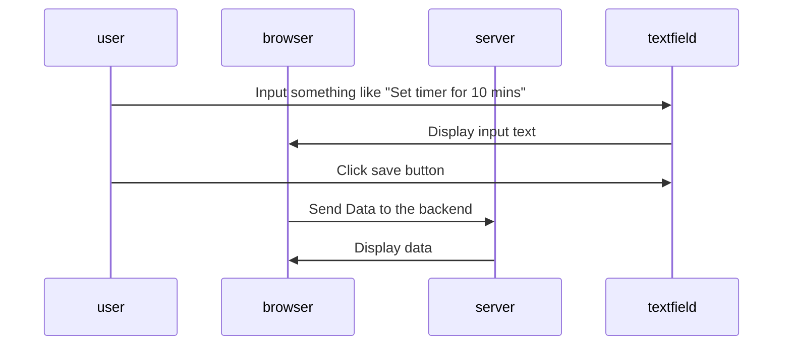

```mermaid

sequenceDiagram

    participant user
    participant browser
    participant server


    user ->>textfield: Input something like "Set timer for 10 mins"
    textfield ->> browser: Display input text
    user ->> textfield: Click save button
    browser->> server: Send Data to the backend
    server ->> browser: Display data

```